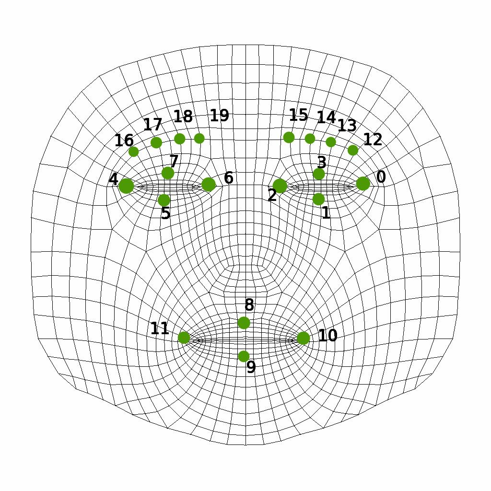
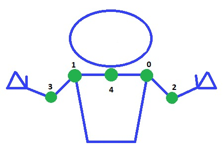
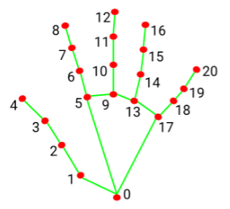

# OpenCV AI Competition 2021 :trophy:
## Hats'i Team :robot:


---
### Automatic Medical Translator :syringe: | Mexican Sign Language - Spanish

<p style="text-align: justify;">
The automatic medical translator recognizes a pre-established set of signs to generate a report with the users' symptoms. The physician will analyze the report and will be able to make the diagnosis and indicate the treatment to follow.
</p>

- The body keypoints were obtained using personalized MediaPipe models
- The prediction process was done using a LSTM network


---
### Install :gear:
Running on Python 3.9.2
Install all the necessary packages
```
pip install -r requirements.txt
```
---
### Usage :video_game:
There are multiple code files:
- `oakD.py` contains all the configuration process to setup the oakD camera
- `bodyPointsDetector.py` gets all the X,Y and Z values in meters of each keypoint
- `signCapture.py` captures a sliding window of 15 frames per sign and generates its CSV file
- `cleanData.py` cleans the dataframes with different operations 
- `modelTraining.py` trains the LSTM model with the sliding windows of 15 frames

#### Run an example
`python3 realTimeDemo.py`

---
### Landmarks Diagrams :dart:
#### Face landmarks <br>
#### Body landmarks <br>
#### Hands landmarks <br>

